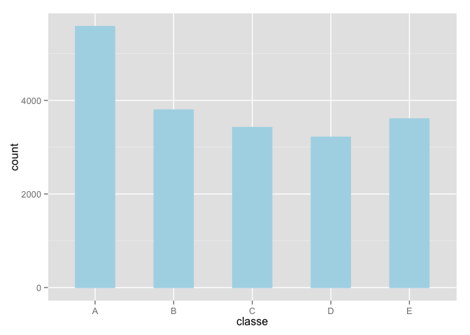
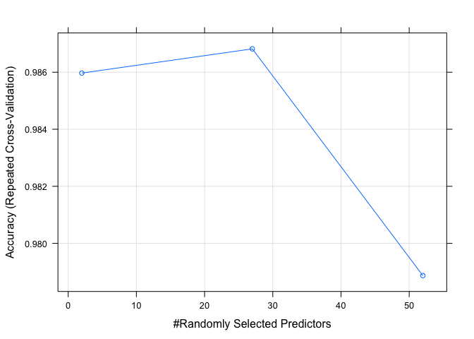

# Weight Lifting Analysis
Fran Martinez  
22 December 2015  
##Synopsis
*Using devices such as Jawbone Up, Nike FuelBand, and Fitbit it is now possible to collect a large amount of data about personal activity relatively inexpensively. These type of devices are part of the quantified self movement - a group of enthusiasts who take measurements about themselves regularly to improve their health, to find patterns in their behavior, or because they are tech geeks. One thing that people regularly do is quantify how much of a particular activity they do, but they rarely quantify how well they do it. In this project, the goal will be to use data from accelerometers on the belt, forearm, arm, and dumbell of 6 participants. They were asked to perform barbell lifts correctly and incorrectly in 5 different ways. Hence our goal here is to classify new data into the 5 established groups: A, B, C, D or E.   
Data comes from an study by Velloso, E.; Bulling, A.; Gellersen, H.; Ugulino, W.; Fuks, H. Qualitative Activity Recognition of Weight Lifting Exercises. Proceedings of 4th International Conference in Cooperation with SIGCHI (Augmented Human '13) . Stuttgart, Germany: ACM SIGCHI, 2013. More information is available from the website here: http://groupware.les.inf.puc-rio.br/har.*

##Collecting Data

Training and Test datasets are available here: https://d396qusza40orc.cloudfront.net/predmachlearn/pml-training.csv, https://d396qusza40orc.cloudfront.net/predmachlearn/pml-testing.csv

We start by calling the library caret for a unified multi-algorithm backend and some parallel computing libraries as well. Then we read the files in while cleaning some NA's. 


```r
library(caret)
library(dplyr)
library(doMC) #for parallel computing
library(e1071)
library(data.table)

registerDoMC(cores=7) #I choose to work with 7 cores.
set.seed(6734)

training <- tbl_df(fread("pml-training.csv", na.strings = c("","NA", "#DIV/0!")))
testing <-  tbl_df(fread("pml-testing.csv",  na.strings = c("","NA", "#DIV/0!")))
```

##Cleaning Data

It is time now to get some clean data. For that we first look for near zero variance variables in our datasets and remove them. Next step is to to remove variables with any NA's and non numeric ones (first seven).


```r
nzv <- nearZeroVar(training)

subtrain <- training[-nzv, ]
subtest  <- training[-nzv, ]

training<-training[,colSums(is.na(training)) == 0] #Removing with all missing values
testing <-testing[,colSums(is.na(testing)) == 0]

training <-training[, -c(1:7)]
testing <-testing[, -c(1:7)]
```
We can now convert `class` variable into a factor variable and plot and histogram to see how much they appear in the set. 


```r
training$classe <- as.factor(training$classe)

ggplot(data=training, aes(x=classe)) + 
  geom_histogram(width = 0.5, color="lightblue", fill="lightblue") 
```

 

We can see they appear relatively similar times except for A (correct weight lift), which appears quite more often. 

###Data Partition
After couples tries at 60 and 70% we decided to cut down the training dataset to 50% for better results. We may explain this with an overfitting of the model: noise makes Itself more visible when we train with a larger amount of data.


```r
inTrain <- createDataPartition(y=training$classe, p=0.5, list=FALSE)
subtrain <- training[inTrain, ]
subtest  <- training[-inTrain, ]
```

###Training
In our `control` variable we store all the fine tunning parameters for our first model, `gbm` which is a generalized boosted regression model with trees. For sampling we use cross-validation with the method `repeatedcv` which stands for repetead cross validation and three repeats each. 


```r
control <- trainControl(method = "repeatedcv", repeats = 3)
gbm <- train(classe ~. , data=subtrain, method="gbm")
predictgbm <- predict(gbm, subtest)
cfgbm <- confusionMatrix(predictgbm, subtest$classe)
```

The confusion matrix gives us a pretty good way to see where our model failed to classify the liftings in one of the five categories. The out-of-sample error is $OSE = 1-accuracy = 1 - 0.9551478 \simeq 0.045$  


```r
cfgbm$table
```

```
##           Reference
## Prediction    A    B    C    D    E
##          A 1651   31    0    1    2
##          B   14 1075   35    6   15
##          C    7   33  979   29    7
##          D    2    0   11  923   19
##          E    0    0    1    5 1039
```

```r
cfgbm$overall
```

```
##       Accuracy          Kappa  AccuracyLower  AccuracyUpper   AccuracyNull 
##   9.629567e-01   9.531344e-01   9.578113e-01   9.676363e-01   2.844520e-01 
## AccuracyPValue  McnemarPValue 
##   0.000000e+00   1.036568e-08
```

The next model we are going to try is the random forest. 


```r
control <- trainControl(method = "repeatedcv", repeats = 3)
rf <- train(classe ~ ., data = subtrain, trControl = control, method = "rf")
predictrf <- predict(rf, subtest)
cfrf <- confusionMatrix(predictrf, subtest$classe)
```


```r
cfrf$table
```

```
##           Reference
## Prediction    A    B    C    D    E
##          A 2778   36    0    0    0
##          B    2 1856    8    0    0
##          C    9    5 1697   20    3
##          D    0    1    6 1588    4
##          E    1    0    0    0 1796
```

```r
cfrf$overall
```

```
##       Accuracy          Kappa  AccuracyLower  AccuracyUpper   AccuracyNull 
##      0.9903160      0.9877480      0.9881746      0.9921582      0.2844037 
## AccuracyPValue  McnemarPValue 
##      0.0000000            NaN
```

###Narrowing down number of variables

As we can see, with the Random Forest model the out-of-sample error is $1-accuracy = 1 - 0.990316 \simeq 0.0097$, which is lower than before. Let's see the most important variables in the model 

```r
varImp(rf)
```

```
## rf variable importance
## 
##   only 20 most important variables shown (out of 52)
## 
##                      Overall
## roll_belt             100.00
## pitch_forearm          60.89
## yaw_belt               54.20
## magnet_dumbbell_z      47.77
## magnet_dumbbell_y      46.11
## roll_forearm           45.97
## pitch_belt             42.65
## accel_dumbbell_y       23.14
## accel_forearm_x        17.51
## magnet_dumbbell_x      17.46
## roll_dumbbell          16.76
## accel_dumbbell_z       15.00
## magnet_belt_z          14.15
## total_accel_dumbbell   14.00
## accel_belt_z           13.82
## magnet_forearm_z       13.81
## magnet_belt_y          12.60
## gyros_belt_z           11.53
## yaw_arm                10.32
## magnet_belt_x           9.87
```

We see that the first seven variables are far more important, i.e., they explain a lot more variance than the rest. We can show this by a plot too.


```r
plot(rf)
```

 

In here we can see how slowly accuracy grows with the addition of more variables and the abruptly falls down at 27. For the sake of computational time, let's refit the model only with those magnitudes.


```r
control <- trainControl(method = "repeatedcv", repeats = 3)
rfreduced <- train(classe ~ roll_belt +
                   pitch_forearm +
                   yaw_belt +
                   magnet_dumbbell_z  +
                   magnet_dumbbell_y  +
                   roll_forearm +
                   pitch_belt, data = subtrain, trControl = control, method = "rf")

predictrfreduced <- predict(rfreduced, subtest)
cfrfreduced <- confusionMatrix(predictrfreduced, subtest$classe)
```


```r
cfrfreduced$table
```

```
##           Reference
## Prediction    A    B    C    D    E
##          A 2752   24    1    0    0
##          B    8 1829   21    4   21
##          C   28   31 1678   14    4
##          D    2   11   11 1586    5
##          E    0    3    0    4 1773
```

```r
cfrfreduced$overall
```

```
##       Accuracy          Kappa  AccuracyLower  AccuracyUpper   AccuracyNull 
##      0.9804281      0.9752511      0.9774890      0.9830769      0.2844037 
## AccuracyPValue  McnemarPValue 
##      0.0000000            NaN
```

As we can see in a much more quick model the Accuracy has not reduced much. The out-of-sample error is $OSE = 1-accuracy = 1 -  0.9804281 \simeq 0.019$, and we are confident enough to use our model for predict the final values.

###Testing


```r
predictrffinal <- predict(rf, testing)
predictrffinal
```

```
##  [1] B A B A A E D B A A B C B A E E A B B B
## Levels: A B C D E
```

Lastly we will used the provided function the write the output in separate text files. 

###Preparing Outputs


```r
pml_write_files = function(x){
  n = length(x)
  for(i in 1:n){
    filename = paste0("problem_id_",i,".txt")
    write.table(x[i],file=filename,quote=FALSE,row.names=FALSE,col.names=FALSE)
  }
}

pml_write_files(predictrffinal)
```


